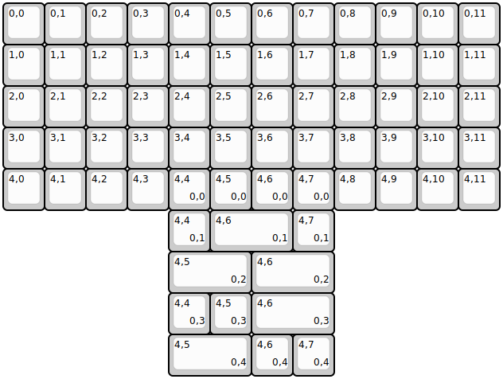
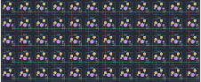

## 0_sixty/0_sixty

[layout](0_sixty-kle.json) - [PCB](0_sixty.kicad_pcb)

[Open in keyboard-layout-editor](http://www.keyboard-layout-editor.com/##@@_c=#aaaaaa;&=0,0&_c=#cccccc;&=0,1&=0,2&=0,3&=0,4&=0,5&=0,6&=0,7&=0,8&=0,9&=0,10&_c=#aaaaaa;&=0,11;&@=1,0&_c=#cccccc;&=1,1&=1,2&=1,3&=1,4&=1,5&=1,6&=1,7&=1,8&=1,9&=1,10&_c=#aaaaaa;&=1,11;&@=2,0&_c=#cccccc;&=2,1&=2,2&=2,3&=2,4&=2,5&=2,6&=2,7&=2,8&=2,9&=2,10&_c=#aaaaaa;&=2,11;&@=3,0&_c=#cccccc;&=3,1&=3,2&=3,3&=3,4&=3,5&=3,6&=3,7&=3,8&=3,9&=3,10&_c=#aaaaaa;&=3,11;&@=4,0&=4,1&=4,2&=4,3&=4,4%0A%0A%0A0,0&=4,5%0A%0A%0A0,0&=4,6%0A%0A%0A0,0&=4,7%0A%0A%0A0,0&=4,8&=4,9&=4,10&=4,11;&@_x:4;&=4,4%0A%0A%0A0,1&_w:2;&=4,6%0A%0A%0A0,1&=4,7%0A%0A%0A0,1;&@_x:4&w:2;&=4,5%0A%0A%0A0,2&_w:2;&=4,6%0A%0A%0A0,2;&@_x:4;&=4,4%0A%0A%0A0,3&=4,5%0A%0A%0A0,3&_w:2;&=4,6%0A%0A%0A0,3;&@_x:4&w:2;&=4,5%0A%0A%0A0,4&=4,6%0A%0A%0A0,4&=4,7%0A%0A%0A0,4)

